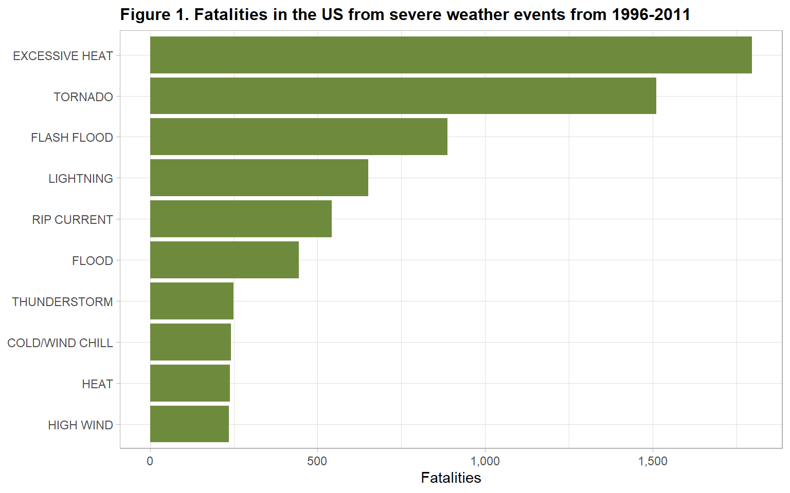
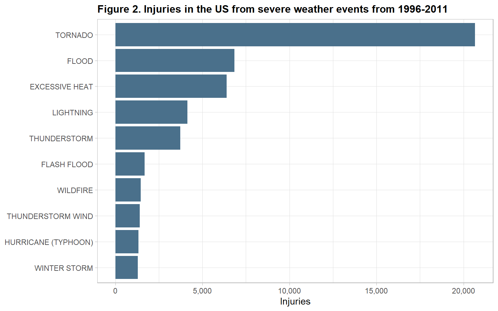
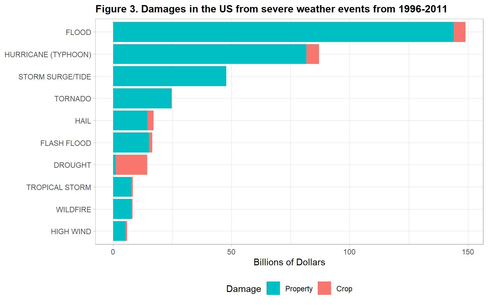

## 1. Synopsis

**Objective**: The objective of this analysis is to answer two questions about severe weather events:

- Across the United States, which types of events (as indicated in the `EVTYPE` variable) are most harmful with respect to population health? 
- Across the United States, which types of events have the greatest economic consequences?

**Analysis**: This analysis uses a subset of the National Oceanic and Atmospheric Administration's (NOAA) Storm Database, limited to events in the US from 1996-2011. Impacts on human health are measured as the total fatalities and injuries as a result of severe weather, and economic consequences as the total costs of property and crop damage.

**Results**: Results show that from 1996-2011 excessive heat accounts for the greatest number of fatalies, tornados for injuries, and floods for economic costs.

## 2. Data Processing

The data for this assignment come in the form of a comma-separated-value file compressed via the bzip2 algorithm to reduce its size. The data and documentation are available from the course web site:

- [Storm Data](https://d396qusza40orc.cloudfront.net/repdata%2Fdata%2FStormData.csv.bz2) [47Mb]
- National Weather Service [Storm Data Documentation](https://d396qusza40orc.cloudfront.net/repdata%2Fpeer2_doc%2Fpd01016005curr.pdf)
- National Climatic Data Center Storm Events [FAQ](https://d396qusza40orc.cloudfront.net/repdata%2Fpeer2_doc%2FNCDC%20Storm%20Events-FAQ%20Page.pdf)

### 2.1. Loading Data


```r
# Load libraries
library(scales)
library(tidyverse)
library(lubridate)
library(knitr)
# Download data
if(!file.exists("repdata_data_StormData.csv.bz2")) {
  download.file("https://d396qusza40orc.cloudfront.net/repdata%2Fdata%2FStormData.csv.bz2", 
                "repdata_data_StormData.csv.bz2") }
# Read data
noaa <- read.csv("repdata_data_StormData.csv.bz2",
                 stringsAsFactors = F,
                 sep = ",",
                 strip.white = T,
                 na.strings = "")
```

### 2.2. Subseting Data

Population health impacts are measured as the fatalities and injuries resulting from severe weather, and economic impacts as property and crop damage. Variables of interest for this analysis are:

- **EVTYPE**: Severe weather event type
- **BGN_DATE**: Start date of severe weather event
- **FATALITIES**: Number of deaths resulting from the severe weather event
- **INJURIES**: Number of injuries resulting from the severe weather event
- **PROPDMG**: Property damage (base amount)
- **PROPDMGEXP**: Property damage multiplier (e.g. K: 1,000; M: 1,000,000, etc.)
- **CROPDMG**: Crop damage (base amount)
- **PROPDMGEXP**: Crop damage multiplier (e.g. K: 1,000; M: 1,000,000, etc.)

The events in the database start in 1950 and end in November 2011. Earlier records only report tornados, thunderstorm wind, and hail. [Records beginning from January 1996 report more comprehensive severe weather event types and are considered more complete](https://webcache.googleusercontent.com/search?q=cache:KW1Sg00sXMsJ:https://www.ncdc.noaa.gov/stormevents/details.jsp+&cd=2&hl=en&ct=clnk&gl=ca&client=safari). We restrict the analysis to weather events from January 1996 and onwards to prevent bias from earlier records limited only to tornados, thunderstorm wind, and hail events.


```r
# Subset weather type, date, health, and economic variables
noaa.subset <- select(noaa,
                      EVTYPE,
                      BGN_DATE,
                      FATALITIES,
                      INJURIES,
                      PROPDMG,
                      PROPDMGEXP,
                      CROPDMG,
                      CROPDMGEXP) %>% 
  
  # Filter weather events from 1996 onwards
  
  mutate(BGN_DATE = mdy_hms(BGN_DATE)) %>% 
  filter(year(BGN_DATE) >= 1996)
```

### 2.3. Recoding Severe Weather Types

The dataset contains over 400 unique values for severe weather types, which must be recoded into the 48 permitted storm event types listed on [page 6, Table 2.1.1 "Storm Data Event Table"](https://d396qusza40orc.cloudfront.net/repdata%2Fpeer2_doc%2Fpd01016005curr.pdf).


```r
# Permittted storm events as listed in data documentation
permitted.storm.events <- toupper(c("Astronomical Low Tide",    "Avalanche",
                                    "Blizzard",                 "Coastal Flood",
                                    "Cold/Wind Chill",          "Debris Flow",
                                    "Dense Fog",                "Dense Smoke",
                                    "Drought",                  "Dust Devil",
                                    "Dust Storm",               "Excessive Heat",
                                    "Extreme Cold/Wind Chill",  "Flash Flood",
                                    "Flood",                    "Frost/Freeze",
                                    "Funnel Cloud",             "Freezing Fog",
                                    "Hail",                     "Heat",
                                    "Heavy Rain",               "Heavy Snow",
                                    "High Surf",                "High Wind",
                                    "Hurricane (Typhoon)",      "Ice Storm",
                                    "Lake-Effect Snow",         "Lakeshore Flood",
                                    "Lightning",                "Marine Hail",
                                    "Marine High Wind",         "Marine Strong Wind",
                                    "Marine Thunderstorm Wind", "Rip Current",
                                    "Seiche",                   "Sleet",
                                    "Storm Surge/Tide",         "Strong Wind",
                                    "Thunderstorm Wind",        "Tornado",
                                    "Tropical Depression",      "Tropical Storm",
                                    "Tsunami",                  "Volcanic Ash",
                                    "Waterspout",               "Wildfire",
                                    "Winter Storm",             "Winter Weather"))
# Split data based on allowed and not allowed event types
noaa.subset.event.allowed <- filter(noaa.subset,  EVTYPE %in% permitted.storm.events)
noaa.subset.event.recode  <- filter(noaa.subset, !EVTYPE %in% permitted.storm.events)
# Recode event types with more than 100 occurances into allowed event types
noaa.subset.event.recode <- mutate(noaa.subset.event.recode,
  EVTYPE = case_when(
    grepl("MARINE",              EVTYPE) ~ "MARINE THUNDERSTORM WIND",
    grepl("TSTM|THUNDE",         EVTYPE) ~ "THUNDERSTORM",
    grepl("FIRE",                EVTYPE) ~ "WILDFIRE",
    grepl("COASTAL",             EVTYPE) ~ "COASTAL FLOOD",
    grepl("FLD|FLOOD",           EVTYPE) ~ "FLOOD",
    grepl("WINTER|SNOW",         EVTYPE) ~ "WINTER WEATHER",
    grepl("COLD|CHILL",          EVTYPE) ~ "COLD/WIND CHILL",
    grepl("FOG",                 EVTYPE) ~ "DENSE FOG",
    grepl("HURRIC|TYPHOO",       EVTYPE) ~ "HURRICANE (TYPHOON)",
    grepl("WARM|HEAT|HOT",       EVTYPE) ~ "HEAT",
    grepl("WIND",                EVTYPE) ~ "STRONG WIND",
    grepl("RIP ",                EVTYPE) ~ "RIP CURRENT",
    grepl("SURGE",               EVTYPE) ~ "STORM SURGE/TIDE",
    grepl("SURF",                EVTYPE) ~ "HIGH SURF",
    grepl("BLIZZ",               EVTYPE) ~ "BLIZZARD",
    grepl("FROST|FREEZ|ICY|ICE", EVTYPE) ~ "FROST/FREEZE",
                                    TRUE ~ "OTHER"))
# Join data frames
noaa.subset <- rbind(noaa.subset.event.allowed, noaa.subset.event.recode)
```

### 2.4. Calculating Total Economic Costs

Total economic costs are calculated by multiplying `PROPDMG` and `PROPDMGEXP`, and `CROPDMG` and `CROPDMGEXP`, respectively. The variables `PROPDMGEXP` and `CROPDMGEXP` are coded as: “B” for billions, “M” for millions, and “K” for thousands. The numbers 1 to 10 represent the power of ten (eg. 10^number).


```r
# Calculate economic costs as total dollars
noaa.subset <- mutate(noaa.subset,
                      
  # Capitalize multiplier codes
  
  PROPDMGEXP = toupper(PROPDMGEXP),
  CROPDMGEXP = toupper(CROPDMGEXP),
  
  # Multiply base damage with appropriate multiplier
  
  PROPDMG.TOTAL = case_when(
             PROPDMGEXP == "H" ~ PROPDMG * 1e+02,         # Hundreds
             PROPDMGEXP == "K" ~ PROPDMG * 1e+03,         # Thousands
             PROPDMGEXP == "M" ~ PROPDMG * 1e+06,         # Millions
             PROPDMGEXP == "B" ~ PROPDMG * 1e+09,         # Billions
    grepl("[0-9]", PROPDMGEXP) ~ PROPDMG * 10^as.numeric(PROPDMGEXP),
                          TRUE ~ PROPDMG),
  CROPDMG.TOTAL = case_when(
             CROPDMGEXP == "H" ~ CROPDMG * 1e+02,         # Hundreds
             CROPDMGEXP == "K" ~ CROPDMG * 1e+03,         # Thousand
             CROPDMGEXP == "M" ~ CROPDMG * 1e+06,         # Millions
             CROPDMGEXP == "B" ~ CROPDMG * 1e+09,         # Billions
    grepl("[0-9]", CROPDMGEXP) ~ PROPDMG * 10^as.numeric(CROPDMGEXP),
                          TRUE ~ CROPDMG))
```

## 3. Results

### 3.1. Health Impacts

Across the United States from 1996 to 2011, out of all severe weather events, excessive heat caused the greatest number of fatalities. Excessive heat accounts for `20.6%` of all severe weather&ndash;related fatalities (`1,787` of `8,732`), followed closely by tornados, `17.3%`. However, tornados account for the greatest number of injuries by far: `42.2%` of all severe weather&ndash;related injuries (`20,667` of `48,917`).

#### 3.1.1. Total Fatalities


```r
# Calculate total fatalies by event type
results.fatalities <- group_by(noaa.subset, EVTYPE) %>% 
  summarise(FATALITIES = sum(FATALITIES)) %>%
  top_n(10, FATALITIES)
ggplot(results.fatalities, aes(reorder(EVTYPE, FATALITIES), FATALITIES)) +
  geom_col(fill = "darkolivegreen4") +
  coord_flip() +
  labs(y = "Fatalities",
       x = "Severe Weather",
       title = "Figure 1. Fatalities in the US from severe weather events from 1996-2011") +
  scale_y_continuous(labels = comma) +
  theme_light()+
  theme(axis.title.y = element_blank(),
        plot.title   = element_text(size = 12,
                                    face = "bold"))
```

<!-- -->

#### 3.1.2. Total Injuries


```r
# Calculate total injuries by event type
results.injuries <- group_by(noaa.subset, EVTYPE) %>% 
  summarise(INJURIES = sum(INJURIES)) %>% 
  top_n(10, INJURIES)
ggplot(results.injuries, aes(reorder(EVTYPE, INJURIES), INJURIES)) +
  geom_col(fill = "skyblue4") +
  coord_flip() +
  labs(y = "Injuries",
       x = "Severe Weather",
       title = "Figure 2. Injuries in the US from severe weather events from 1996-2011") +
  scale_y_continuous(labels = comma) +
  theme_light() +
  theme(axis.title.y = element_blank(),
        plot.title   = element_text(size = 12,
                                    face = "bold"))
```

<!-- -->

### 3.2. Economic Impacts

Across the United States from 1996 to 2011, floods caused the greatest economic damage (i.e. total costs of property and crop damages). Floods and hurricanes are the only severe weather events with an excess of `$50-billion` in economic damages. However, floods are far more costly, resulting in a total of `$144-billion` in economic damages, compared to hurricanes, totalling `$82-billion`.


```r
# Calculate total economic damages (ie. property & crop damages) by event type
results.economic <- group_by(noaa.subset, EVTYPE) %>% 
  summarise(TOTAL.PROP.DMG = sum(PROPDMG.TOTAL),
            TOTAL.CROP.DMG = sum(CROPDMG.TOTAL)) %>%
  mutate(TOTAL.DMG = TOTAL.PROP.DMG + TOTAL.CROP.DMG) %>% 
  top_n(10, TOTAL.DMG)
  
# Prepare data for plotting and scale to billions
results.economic <- select(results.economic, -TOTAL.DMG) %>% 
  gather("DMG.TYPE", "DMG.DOLLARS.BILLION", -EVTYPE) %>% 
  mutate(DMG.DOLLARS.BILLION = round(DMG.DOLLARS.BILLION / 1e+09, 2),
         DMG.TYPE = recode_factor(DMG.TYPE,
                                  TOTAL.CROP.DMG = "Crop",
                                  TOTAL.PROP.DMG = "Property"))
ggplot(results.economic, aes(reorder(EVTYPE, DMG.DOLLARS.BILLION),
                             DMG.DOLLARS.BILLION, fill = DMG.TYPE)) +
  geom_col() +
  coord_flip() +
  labs(y = "Billions of Dollars",
       x = "Severe Weather",
       fill = "Damage",
       title = "Figure 3. Damages in the US from severe weather events from 1996-2011") +
  guides(fill = guide_legend(reverse=T)) +
  scale_y_continuous(labels = comma) +
  theme_light() +
  theme(legend.position = "bottom",
        axis.title.y    = element_blank(),
        plot.title      = element_text(size = 12,
                                       face = "bold"))
```

<!-- -->